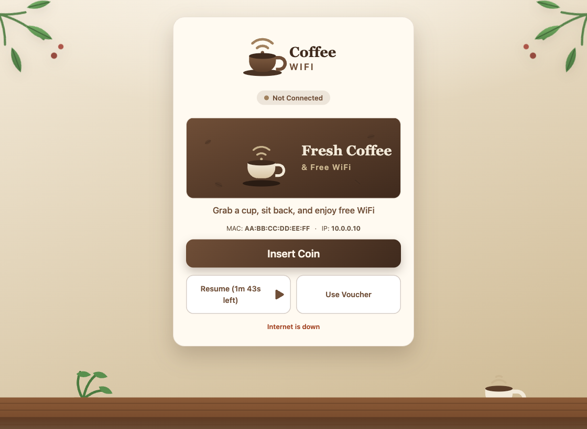

Give your hotspot the warm, inviting feel of your café. This captive-portal theme
wraps your customers' sign-on screen in a cozy khaki-and-brown coffee-shop scene —
leafy greenery in the corners and a wooden table underfoot.

## Why café owners love it

- **On-brand welcome** — show your own logo, a banner image, and a friendly
  welcome message the moment guests connect to your WiFi.
- **Change it yourself, anytime** — update the logo, banner, and welcome text from
  a simple settings page. No code, no reinstall.
- **Warm coffee-house look** — a soft khaki and roasted-brown palette with green
  leaves and a wooden table that feels like your shop.
- **Works out of the box** — ships with tasteful default artwork, so it looks great
  before you change a thing.
- **Made for phones** — clean, fast, and easy to tap on any screen size.

Turn your free-WiFi page into part of the experience — and keep your café's name in
front of every guest.

Powered by Flarewifi.
